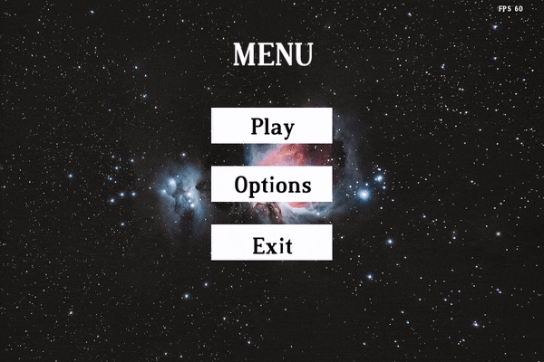
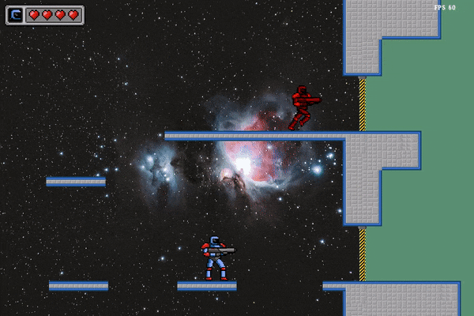
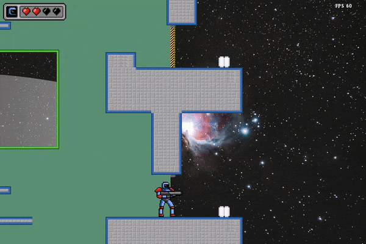

# **🎮 Space Gunner 🔫**

Space Gunner is a simple platform game written in C++ using the SFML 2.5.1 library.  
This game is my first programming project and it was created for educational purposes.

## Gallery 📷

  

  

  

## Graphics and sounds used in the project 🤝

### Graphics 🎨

* Background - https://www.pexels.com/pl-pl/zdjecie/zdjecie-supernova-in-galaxy-3805983/ (Alex Andrews) 
* Hero and scene textures - https://opengameart.org/content/open-gunner-starter-kit (Master484) 
* Asteroids - http://opengameart.org/users/varkalandar (Hansj�rg Malthaner) 
* Font - https://www.1001freefonts.com/dustismo-roman.font (Cheapskate Fonts) 
* jetpack - https://opengameart.org/content/monkey-on-mars-share-the-love (dannorder) 

### Sounds 🔉

* shot1 - https://freesound.org/people/michael_grinnell/sounds/512469/ (michael_grinnell) 
* jump - https://freesound.org/people/BehanSean/sounds/422426/ (BehanSean) 
* run - https://freesound.org/people/Nox_Sound/sounds/558471/ (Nox_Sound) 
* maintheme - https://freesound.org/people/klavo1985/sounds/519410/ (klavo1985) 
* mudrun - https://freesound.org/people/EminYILDIRIM/sounds/554711/ (EminYILDIRIM) 
* jetpack - https://freesound.org/people/primeval_polypod/sounds/158894/ (primeval_polypod) 
* hurt - https://freesound.org/people/tonsil5/sounds/416839/ (tonsil5) 
* airlock - https://freesound.org/people/Velvorn/sounds/95773/ (Velvorn) 
* gameover - https://opengameart.org/content/game-over-bad-chest-sfx (Oiboo) 

## Caution ⚠️

The executable file was created on a machine with Linux Mint 21.2 and an x86_64 processor.  
If you want to run the game on another system, you must compile the project by yourself.  
Remember to install and link the SFML library 😉. 

## License 📄
[MIT License](LICENSE)